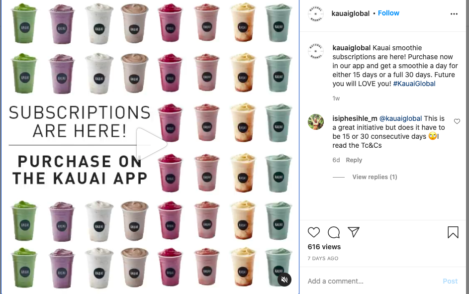

It’s been almost a year since the first Covid-19 case in South Africa, and although we had expected some changes in our daily lives, I don’t think we had anticipated the effects to be this devastating.

A study published in collaboration with the Department of Small Business Development and a number of other business groups indicates that 42,7% of small business were forced to close down. The forced closure came as a result of existing debt, lack of cash reserves, outdated financials, no access to relief funding, and an inability to operate during the lockdown.

Read: [Lockdown forced nearly half of small businesses in South Africa to close: study.](https://businesstech.co.za/news/business/455100/lockdown-forced-nearly-half-of-small-businesses-in-south-africa-to-close-study/)

We were looking forward to economic recovery and the beginning of a healing process for business during the festive season; however, the increase of activity led to a hike in the infection and death rate, pushing us back to a level 3 lockdown.

These are truly unprecedented times and a very difficult time to keep any business afloat. In light of all the uncertainties surrounding the pandemic, we have sought out 5 survival tips that we think businesses will need to survive.

## Be Ready To Adapt To Anything

Unprecedented times carry a lot of uncertainty as we step into a whole different world than the one that we were used to. We went from dressing up head to toe for meetings to rocking up for Zoom meetings with a whole different definition of semi-formal. The screen became our primary platform for interacting with different stakeholders and all business owners were forced to adapt or be at risk of losing customers and ultimately, run out of business. It is war and the only ones who will come out alive, are those who can adapt quickly.

> “2021 is uncertain, but what is absolute should be your ability to adapt to anything.” -James Jorner.

Read more: [5 Business Survival Tips for 2021](https://www.entrepreneur.com/article/362611)

One example of a business that had to adapt after the first announcement of a National lockdown, is [The Yoga Room](https://www.theyogaroomcpt.co.za/). The Yoga Room is a Cape Town-based yoga studio that used to have physical classes with their members. Unfortunately, like many other businesses they had to close down their studio to keep to the regulations. They announced the closure of their studio on the 17th of March and started their first online class on the 18th of March. The owner, Elsa Van Niekerk says that they had to convince their members that an online class can bring then the same satisfaction as getting together in a physical space.

As much as closing down was a bit of a challenge, it did open up new ventures and came with benefits as they can now reach people beyond the Cape Town borders. Furthermore, they could stay in business and help their members to get through these challenging times.

## Automate Business Processes That Are Eating Up Your Time

Even during “normal times”, small businesses don’t always have the resources to hire enough staff members to fill up all the required position for a business to run smoothly. Now we find ourselves dealing with constant sick leaves and having to let go of some staff members either due to death or lack of financial resources to keep them there. Whatever the reason may be, you do not want to find yourself juggling 20 tasks at the same time while there is plenty of software that can automate some business process. For instance, Waitr will generate a financial report for you, saving you time and the risk of human error.

## Set Up Subscription-Paid Services

Lauren Pearson advises business owners to offer subscription-paid services if their business model allows for it. This is a great way to ensure income over a long period and for the client to receive products or services without having to go through, sometimes lengthy payment process.

We love this tip! At the end of the day, you have salaries and bills to pay, and for you to have peace of mind, you need to have a certain amount of income every month. Subscriptions will give you an idea of the minimum income that you are certain of and reduce the chance of losing customers.

Read more: [12 Survival Tips for Small Businesses in 2021](https://www.sage.com/en-us/blog/top-12-survival-tips-small-businesses/)

Health food restaurant, [Kauai,](https://www.instagram.com/p/CKOIX8jH9x2/) has taken the lead in its industry in offering a subscription service. Customers can redeem up to 240 coffees over 30 days for just R299. Customers get value on organic coffees and smoothies while the business gets to build loyal relationships which in return will bring in recurring revenue.

## Be Persistent

We asked Melvin Musehani, founder of Waitr, to weigh in and this is what he had to say:

> “If something works once, it has a possibility to work again, so keep doing that thing for the business to grow.”

His tip to business owners is to carry on with whatever proves to be growing the business until they find a better method that will replicate the results of what they have done. As a founder, you would want to replicate parts of yourself through your employees who would be persistent. Small businesses don’t always have the luxury of having employees, so your best solution as an owner, is to act as a sub employee within yourself and be persistent with that action because that is what the employee was going to do.