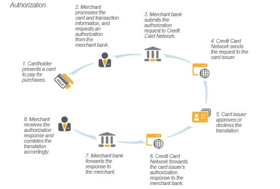

We know that besides dealing with normal business to customer communication, as a small business owner, you have many other languages that you have to familiarize yourself with. Small business owners often have to wear many hats until their business gets to a level where they can open up various positions and hire people to assist them.

You might be sitting there with your many hats right now or be one of those CEO’s who wants to be clued up with everything that is happening in their company. Either way, we are here to shed some light on a few basic E-commerce terms to help you in your journey of taking your business online.

#### 301 Redirect:

This is a status code which indicates the permanent moving of a web page from location to another. This is the best way to ensure that your users and search engines are redirected to the correct web page.

#### Abandonment:

Abandonment or cart abandonment is when a potential client adds products to their cart for online purchase but leaves the web page before completing the process.

#### Authorization:

This is the process of granting someone permission to make decisions, take action, or to give orders.

#### Billing address:

A billing address is an address that is associated with your card. This is address is used to verify the client’s credit card information and also to send the client’s credit card statements.

#### Bounce rate:

A bounce rate is a measurement used in web analytics to measure the percentage of single-page sessions on your website. A single-page session is when a user only visits one page on your website. If the success of your website only depends on a single-page visit, then a high bounce rate percentage would be good. However, if your home page has many links to encourage users to navigate through your website but users leave before exploring other pages, then a high bounce rate will not be good.

#### Cart abandonment rate:

The cart abandonment rate is a percentage of the number of virtual shopping carts that were created but didn’t make it through to the final check out step compared to the number of shopping carts that were created.

#### Chargeback:

A chargeback is a forced transaction reversal that comes directly from the bank. A chargeback is more beneficial to the consumer as it acts as a shield between the consumer and dishonest merchants.

#### Discount Code:

A discount code is a personalized or public code that is given to consumers to take a certain percentage off their order cost.

#### Payment Gateway

A payment gateway is a merchant service that processes card payments for e-commerce sites and physical stores.

#### Payment Card Industry (PCI) compliance:

PCI compliance refers to the technical and operational standards that businesses follow to secure and protect credit card data provided by the cardholder. These standards are developed and managed by The Payment Card Industry Data Security Standards.

#### Point-of-sale (POS) system

A Point of Sales system is a place where a customer can make a payment for products and services and pay sales taxes. It is a revolutionized version of the traditional cash register system which can be in a physical store or used for online shopping.

You can read about the benefits of having a POS System [here.](https://www.waitr.co.za/advantages-of-a-point-of-sale-system/)

#### QR Code

A Qr Code or Quick Response code is a two-dimensional barcode that contains information about the item to which it is attached.

#### Recurring payment:

A recurring payment happens when a client goes into an agreement with the merchant to automatically bill them on a specified schedule.

#### Shipping:

Shipping refers to the physical moving of goods from one place, in this instance, from the merchant to the client. This service usually comes at an added fee or included in the product price.