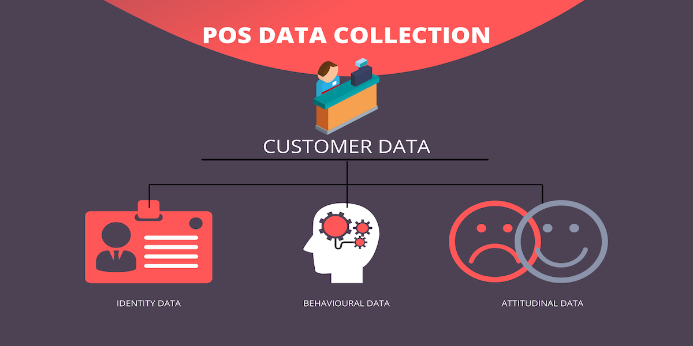

Not so long ago, small business owners would have an internal victory dance at the sound of the cashier hitting those keys and the cash drawer’s high pitched cling, announcing a successful sales transaction. Today point of sale systems (pos) has become more than just a tool for present victories that become a distant memory the minute the client walks out of the shop. 

They mark the victory of a successful transaction and the hope of future transactions. Technology has advanced greatly from the years of the cash-till. They now offer retailers access to a variety of data to manage and increase sales. 

> “Without big data analytics, companies are blind and deaf, wandering out onto the web like deer on a freeway.” ~ Geoffrey Moore, management consultant and author of Crossing the Chasm.

Geoffrey Moore said it, and we totally agree with him. Small business owners venture into business with success in mind, but only those who make smart decisions, get to experience it. These are the individuals who understand the importance of data. With the right data analytics, you can see past failures and successes and the reasons for those outcomes. You can then use the insight to predict and prepare for future trends to prevent your business from wandering around like a deer on a freeway.  

Let us look at the different types of customer data obtainable through a POS system.

# Customer Data

Companies that know what their customers want and expect can improve their customer experience to create strong relationships, which will result in loyalty and repeat business. 

**It is the responsibility of every business owner to familiarise themself with the [regulations of personal information laws](https://popia.co.za/) to avoid penalties for non-compliance.** 

## Types of customer data:

We will only look at 3 of the 4 types of customer data. 

### Personal data 

Personal data can be divided into two categories, Personally Identifiable Information (PII) and Non-Personally Identifiable Information (Non-PII). The information that we will collect and have access to on a pos system is the PII, which is any information that can be used to identify an individual. 

This is information such as:

Full name

Physical address

Email address

Login details

Driver’s license number

Passport number

Credit/debit card details

Date of birth

Phone number

This data can be collected and organised using customer relationship tools. Customer relationship management or CRM refers to all strategies, techniques, and technologies that organisations use to manage their interactions with current and potential customers. It is important to ensure that your pos system is CRM-enabled in order for you to collect customer-related data. 

### Behavioural data 

Behavioural data is information that indicates certain patterns that occur during the customer’s purchase journey.

The following behavioural data can be obtained through a pos system:

1. Transactional Data: Payment options, Loyalty program, refunds, cancellations, and purchase history.
2. Product usage: Product purchase frequency, the quantity of consumption, product affinity (which products the customer likes using together)

### Attitudinal Data

Attitudinal data gives you the insight to understand how customers view your business. Such information can be obtained through reviews, ratings and surveys. 

## Benefits Of Customer Data

Once you have collected your customer data, you are able to implement targeted marketing campaigns. This will enable you to send personalized messages, in order words, messages that your customers would appreciate and actually read. Personalized messages indirectly say, “We care so much about you that we made sure we know exactly what you need and now we are offering it to you under special conditions”. Now this could lead to two possible outcomes, the customer could get convinced to make a purchase, or to the least, talk about your business to people who trust them Therefore; you could get sales, free marketing, and potential new clients just through one personalised message. 

Furthermore, Behavioral data will assist you in preparing your products, equipment and staff. Since the data is more related to how and when your customers purchase your products, you will be able to plan and manage your inventory and stock to eliminate any losses or shortages. The frequency or product consumption will assist in planning employee work schedules to ensure that you have enough staff members on your busy days.

Lastly, attitudinal data will give you insight into how your customers view your business as a whole or certain service, products, and employees. This insight comes in the form of ratings and feedback, which can be obtained in various ways. [Waitr](https://www.waitr.co.za/) for instance sends a link in the ‘order ready’ message which leads the customer to a page where they can send their feedback, and the business owner can respond to that message. Even though a customer might have had negative feedback, they might change their perspective of your company depending on when and how you respond to their feedback. Communication is very important in a relationship and when it’s two-way, the relationship gets strengthened and the customer becomes loyal to your company. Once loyalty is established, the customer can move on to becoming an advocate for the company. All this is possible just through knowing your customers and using that insight to implement strategies and efforts to give them what they want. 

So unlike the old cash tills, current POS systems help to deepen relationships between the company and its customers to increase your revenue.