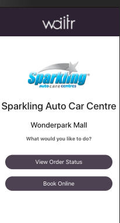

I want it now! Make it quick, easy and ensure there’s value for money. Businesses are dealing with busy consumers who are trying to have as many of their tasks done, in the most efficient way possible, and technology is making it possible. 

The technology-empowered consumer demands real-time and quick service delivery and is forcing their favourite companies to get onto their smartphones. They want their needs and wants to be taken care of at the exact moment with a simple click of a button. It is therefore no surprise that there are more than 8.9 Million apps worldwide. 

You might have a satisfying number of walk-in or phone call orders and wondering if you really need to go through all the effort of going online. Well, you could remain with those customers or put in some effort to tap into a bigger market of 68% of South African consumers who are shopping online. 

Ordering in was not just a thing for the hard lockdown period, people love the convenience of receiving items at their doorstep. 

## Benefits Of An Online Booking System

## 24/7 Bookings

One of the greatest benefits of having an online booking system for you and for your clients is the flexibility of booking at any time of the day or night. Businesses that don’t offer a 24/7 booking system will most likely have to fight for a timeslot during business hours on a client’s already busy schedule. Chances of that client going online and finding an alternative business offer the same services and/or products are very high.

## Save Time Spent On Admin

Small business owners don’t always have the capital to afford a whole team with designated tasks and have to rely on their multi-tasking skill to get everything done. Now imagine how great it would be to have at least one task that is automated, freeing up some time for you to focus on other tasks. 

An automated booking system will ensure that you don’t miss an order during your busy schedule. Depending on your system, you can automate functions such as:

\-Collecting customer information.

\-Having the client book their own convenient time slot from your available slots.

\-Sending out order process updates

\-Sharing order information with relevant parties, such as the drop off location with the driver.

You can book an appointment with [Sparklings Wondepark ](https://sparkling-wonderpark.waitr.co.za/)right now and their system will automatically be updated.

## Makes Resource Allocation Easier

Online bookings will help you allocate your resources perfectly according to the demand. You could even easily plan your resources ahead and get extra hands for the weeks or days that you will be fully booked on. This is will also help in inventory management and ensure that you don’t run at a loss or lose clients because of inventory shortage.

## Get valuable insights into your business

An online booking system can provide you with valuable information that could assist you in making well-informed decisions which will lead to an increase in revenue. [Waitr](https://www.waitr.co.za/), for instance, will show you the following insights:

\- Percentage of online sales compared to in-store sales

\- Clients information 

\- Purchasing patterns

\- Average order completion time

\- Most order item or service

## Reduces Chances Of Miscommunication

I cannot recall a time when I tried to place a pizza order without having to repeat some words. The reality is that people’s pronunciation differs, phone connections aren’t always good, and people aren’t always certain about what they want. So there is bound to be a misunderstanding between a client and a salesperson. However, with a self-service online booking system, a client gets to see the options they can choose from and be sure to choose the correct option without any miscommunication. Fewer miscommunications mean, fewer or no product returns and customer grievances. This is especially a great benefit for business, like restaurants, that run at a loss when products get returned.

Online booking systems are on the rise and a favourite to both consumers and business owners who took a leap of faith to implement them into their business. 

Also read: [Introducing Waitr Online - A free Mobile App For Our Merchants](https://www.waitr.co.za/introducing-waitr-online-a-free-app-mobile-app-for-our-merchants/).