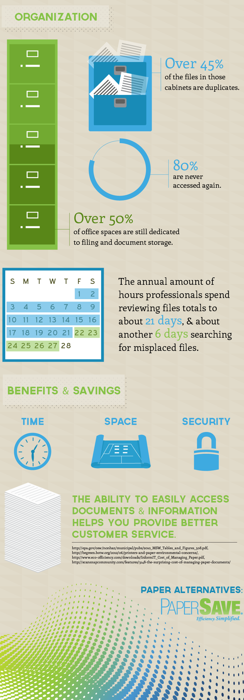

There is not a day that goes by without seeing papers. Be it a poster on the wall, an important contract or an invoice. Paper is everywhere! It is almost hard to believe that any business can get to a point of operating without paper. 

The concept of a paperless office has been making the rounds for years, and for many businesses, it is still a myth. However, with the rise of digitization, going paperless is no longer a far-fetched concept. It is possible and promises great benefits for the business and the greater environment. 

## What Is A Paperless Office

A paperless office refers to a work environment in which the use of papers has been drastically reduced or totally terminated. This is achieved by converting documents from hard copy to a digital format and further implementing processes to do tasks digitally. 

## What To Consider Before Going Paperless

### Type Of Business

Although going paperless is possible, the type of business will determine the extent to which a business can go paperless and difficult or easy it will be to convert to a paperless office. A business that has been existing for some years will likely have piles of storage boxes filled with documents that would have to be digitized. For this reason, the process of digitization will require a lot of time, and the business owners will have to determine which documents will be digitized and which ones will remain as hard copies. 

### Employee’s Technological Skills 

Going Paperless means moving away from the easy pen and paper method of doing things to a process that can be a bit more complicated to some employees. Firstly, you will have to discuss the idea of moving towards a paperless office to prepare them for what is to come. This is a huge adaptation, so it will only be fair to give every employee enough information and the opportunity to decide whether they are up for the challenge or not. Secondly, you will have to offer skill training programmes and workshop so that everyone will have the right skills to function in a paperless office. 

### Office Equipment

You might be getting rid of a few printers and fax machines since you won’t be needing those any longer. Before you can get to the exciting part of purchasing new technological devices, you will first have to go back to the results you go from analysing to what extent your business can go paperless and how much work needs to be done in preparation for that. This will determine if you perhaps need to get temporary equipment such as scanners for the process of digitization. 

### Budget

Budget plays a big role in this process. More money could be spent before the company can start saving if the company has been operating paper-based for a long time. This is especially true for companies that aren’t technologically advanced. However, the process becomes less costly the more tech-savvy and technologically equipped a company is. It is important to calculate the cost of digitizing all current papers and documents, purchasing new devices, and training employees. 

Let’s dive into the benefits before you write this off as a daunting process. 

## Benefits Of A Paperless Office

### Cost reduction

Adopting the paperless approach will save your company more than just paper. One employee uses an average of 10 000 sheets of paper a year. So you can just imagine how much you will save on printer servicing, toners, postage, and physical storage, just to name a few. 

### Collaboration

Digitization of documents means that all employees will have access to the necessary documents. This could possibly increase productivity and eliminate instances where work is not done or late due to one employee being unavailable or absent. 

This is one of the best benefits for companies that are working remotely. There are great software that allows companies to save their work on a cloud, making it accessible to all employees, and also those that allows employees to work on the same document from their different devices. 

### Enhanced Security 

Physical papers carry so much risk of being compromised, misfiled, destroyed, or even stolen. So you should be able to depend on a system that is a little more secure than a locked cabinet. A Paperless approach offers you a much higher level of security for you and your clients. 

### Easier Access

A paperless approach gives you access to all digitized documents from anywhere in the world. Cloud storage allows you to store your data on the internet through a cloud computing provider. So you no longer have to stress about forgetting crucial documents for meetings. This will also help in improving customer experience as you would be able to access necessary information quicker and easier. 

## Why Are People Still Using papers?

### Legal Necessities

Some legal firms still insist on signed hard copies for legal agreements. Meaning that companies are forced to use paper for loans or selling and purchasing business assets. However, more and more lawyers are moving toward a paperless approach and we trust that we will soon be signing legal documents online. 

### Government requirements 

Some government departments might request that you keep hard copies of your documents. However, there has been a rise in government E-platforms which gives us the hope of a move towards the paperless approach. 

A paperless office might have seemed impossible before, but with the technology at our disposal and cloud-based applications, we are moving closer to busting this myth.